# Designing Virtual Worlds: Complexity, Emergence, and Cellular Automata

**Note: This is *not* my work, it's a repo of files from a workshop during Waterloo Unlimited 2010.

This workshop looks at how simple rules can lead to complex, unexpected results. We start with a basic simulated world and add rules and simple creatures, exploring what happens when these rules are changed. Programming experience is not required.

## Overview

*   [Complexity](#complex)
*   [Cellular Automata](#ca)
*   [Simple Worlds](#worlds)
*   [Designing Complexity: Replicating Loops](#loops)
*   [Simple Worlds for Agents](#agents)
*   [Ants and Pheromones](#pheromones)
*   [How to change the Worlds](#config)
*   [Things to try](#try)

## Complexity

*   I am a cognitive scientist. This means I study cognition (or "thinking" or "the brain") and try to figure out how it works.
    *   To do this, I need to come up with theories as to what things can combine together to result in behaviour that matches what we observe.
        *   This is the basis of all science: observe a phenomenon, theorize about how it would work, and then test the theory by comparing what the theory says should happen to what actually happens.
    *   But, brains are really really really complicated. The most complex thing science has ever tried to understand.
        *   I need to design complicated theories to explain how the brain works.
        *   As things get more complicated, it becomes harder to design them.
        *   Putting simple components together can result in complex, surprising behaviour ("emergence")
    *   This is what I want look at in this workshop.
*   What are we going to do?
    *   We won't be designing brains: we'll be designing whole _worlds_.
    *   We'll make changes to how these worlds work (and how the things in them interact), and see what happens.
    *   We'll (probably) be surprised by some things, and see how hard it is to predict what will happen when we change the design
    *   First, I'll show a bunch of examples, and give a quick demo of how to make certain changes to the worlds
    *   The rest of the time you will be making changes and seeing what happens. I'll give a list of a bunch of things you might like to try, but feel free to try other things too.
*   What does this have to do with Design?
    *   There are two aspects of design throughout this session: a low-level design and a high-level design.
    *   Low-level Design
        *   How do we write computer code so that the world follows the set of rules we want it to follow?
        *   This is a programming task: how do we convert "count the number of neighbours whose value is 1" into:

            <pre>    count=0
                for n in self.neighbourhood:
                  if n.value==1:
                    count+=1
            </pre>

        *   This is not what we are going to be focusing on.
        *   Any time you are stuck on things like this, come tell me. I've chosen a programming language where this sort of mapping is as direct and straightforward as possible, but there will still be situations where this sort of programming questions will arise.
    *   High-level Design
        *   How do we choose rules so that the world behaves how we want it to?
        *   This is the real design question for this session.
        *   This is a really hard question.
        *   We will learn by experience through seeing how changing rules changes the overall behaviour.

## Cellular Automata

*   Virtual universes where we make up the rules and see what happens.
*   Generally considered part of "Artificial Life"
*   Three basic components to play with:
    *   The structure of the universe
    *   The things within the universe
    *   The rules controlling interactions
*   Structure

*   What is the space of the universe like?
    *   The word 'Cellular' indicates that we divide the universe up into 'cells'.
    *   Each of these cells is connected to other cells to form a 'lattice'.
    *   The set of cells a given cell is connected to directly is its 'neighbourhood'.
*   How many dimensions?
    *   2D is most common. Also lots of work with 1D, very little with 3D
    *   I find 1D too simple. 2D seems to be as simple as one can get and still be interesting to cognitive science.
*   How is it organized?
    *   Usually as a square grid
    *   Doesn't have to be this way:
        *   Hexagonal grid
        *   Triangular grid
        *   Wacky 3D tilings
        *   any repeating pattern that can be coded has probably been tried
*   What about the edges?
    *   Sometimes we just have an infinite universe with no edge (well, more technically, we program it so that if anything is happening near the edges, the universe gets a bit bigger by adding cells)
    *   More often, we just connect the edges of the world up to each other.

*   Things
    *   Each cell contains data (its 'state')
    *   Simplest case: each cell is either '0' or '1'
        *   'Dead' or 'Alive'
        *   'Empty' or 'Filled'
        *   (it's probably better to just think of the data as numbers, rather than any sort of semantic content)
    *   Can be anything
    *   Since we're generally wanting to visualize these systems running, we also usually define a 'colour' for each cell (based on its contents)
*   Rules
    *   How does the system change over time?
    *   The rules change a cell's state based on its current state and the states of its neighbours
    *   Neighbourhoods:
        *   We don't want every cell to worry about every single other cell whenever it's updated (that would a) take forever, and b) be ridiculously complicated).
        *   Instead, we focus on its surroundings
        *   Two most common:
            *   von Neumann Neighbourhood:   
                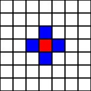  
                (image stolen shamelessly from [here](http://www.ifs.tuwien.ac.at/~aschatt/info/ca/ca.html))
            *   Moore Neighbourhood   
                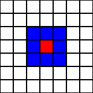  
                (image stolen shamelessly from [here](http://www.ifs.tuwien.ac.at/~aschatt/info/ca/ca.html))
        *   Lots and lots of other options
            *   [http://cell-auto.com/neighbourhood/index.html](http://cell-auto.com/neighbourhood/index.html)
    *   The Rules:
        *   Example:
            *   If the cell is in state 1, change it to state 0
            *   If a cell is in state 0 and it has exactly 2 neighbours in state 1, change it to state 1

                <pre>def update(self):
                  if self.value==1:
                    self.value=0
                  else:
                    count=0
                    for n in self.neighbourhood:
                      if n.value==1:
                        count+=1
                    if count==2:
                      self.value=1
                   </pre>

        *   Can also have much more complex rules
            *   Pheromone diffusion:

                <pre>def update(self):
                  total=0
                  for n in self.neighbours:
                    total+=n.pheromone
                  average=total/len(self.neighbours)
                  self.pheromone+=(average-self.pheromone)*diffusionRate
                </pre>

### Simple Worlds

*   World 1: **Seeds**
    *   A fairly simple rule:
        *   If the cell is in state 1, change it to state 0
        *   If a cell is in state 0 and it has exactly 2 neighbours in state 1, change it to state 1

            <pre>def update(self):
              if self.value==1:
                self.value=0
              else:
                count=0
                for n in self.neighbourhood:
                  if n.value==1:
                    count+=1
                if count==2:
                  self.value=1
               </pre>

    *   What does it do?
        *   If everything's in state 0, nothing happens
        *   If one thing is in state 1, it just goes to state 0 in the next time step, and then we stop
        *   If there are 2 cells in state 1 that are touching each other:
            *   Step 0:  
                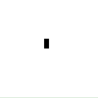
            *   Step 1:  
                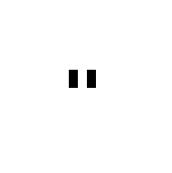
            *   Step 2:  
                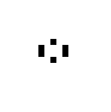
            *   Step 3:  
                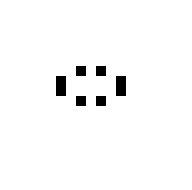
            *   Step 4:  
                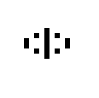
            *   Step 5:  
                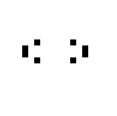
            *   Step 6:  
                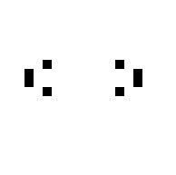
            *   Step 7:  
                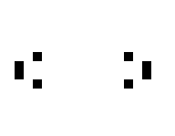
        *   If we have an infinitely big world, they will go on forever
        *   If the world wraps around, they will hit each other
        *   Interestingly, when they do hit each other, they 'bounce off' and 'replicate', ending up with 4 of them heading back from whence they came.  
            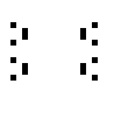
        *   And then when those hit each other?
            *   _(Run seeds.py)_
        *   What if we start with a random pattern?
        *   This universe is known as an 'exploding' universe: No matter what we start with (other than a few pathological cases), the patterns grow and expand until they fill up the whole space.
*   World 2: **Move**
    *   Rule:
        *   If a cell is alive, and it has 2, 4, or 5 neighbours, it stays alive (otherwise it dies)
        *   If a cell is dead, and it has 3, 6, or 8 neighbours, it becomes alive

        <pre>  def update(self):
            count=0
            for c in self.neighbours:
              if c.value!=0: count+=1
            if self.value==1:
              if count!=2 and count!=4 and count!=5:
                self.value=0
            else:
              if count==3 or count==6 or count==8:
                self.value=1
          </pre>

    *   What does this do?
        *   _(Run move.py)_
    *   Not much. Starting out with some simple patterns, they just seem to die out or get locked into a stable pattern. Same thing if you start with a randomly filled universe.
    *   This is a 'stable' universe.
    *   Note: there's one exception. Starting with the following pattern is rather nifty

        <pre>   XX
           XXX
           XXX
           XX
          </pre>

*   World 3: **Life**
    *   The most famous and well-studied of all CAs.
    *   Rule:
        *   If a cell is alive, and it has 2 or 3 neighbours, it stays alive (otherwise it dies)
        *   If a cell is dead, and it has exactly 3 neighbours, it becomes alive

        <pre>  def update(self):
            count=0
            for n in self.neighbours:
              if n.value!=0: count+=1
            if self.value==0:
              if count==3:
                self.value=1
            else:
              if count<2 or count>3:
                self.value=0
          </pre>

*   What does this do?
    *   _(Run life.py)_
*   Sort of in-between.
*   This is a 'Chaotic' system. Activity doesn't die down into a regular pattern, but yet it also doesn't explode all over the place. We seem to be able to pick out individual 'things' in the space. These things grow and shrink and interact in 'interesting' ways. These worlds are the ones that get everyone all excited about CAs.

### Designing Complexity: Replicating Loops

*   We've seen 'motion' and we've seen things creating other things.
*   Can we get reproduction?
*   Yes. Von Neumann came up with one in the 50's (rather before wide-spread computing, so he did it all by hand)
*   Christopher Langton came up with a more stream-lined version later (1984):
    *   8 states
    *   Only 4 neighbours
    *   Massive list of almost 200 state transition rules:

        <pre>Cell   N   S   E   W     Change to
          0    0   0   0   1         2
          0    0   0   0   6         3
          0    0   0   0   7         1
          0    0   0   1   1         2
          0    0   0   1   2         2
          .
          .
          .
          7    0   2   3   2         1
          7    0   2   5   2         5
          </pre>

    *   (plus all of the rotationally symmetric rules)
    *   Definitely a 'stable' universe, unless you start with this:

        <pre> 22222222
        217 14 142
        2 222222 2
        272    212
        212    212
        2 2    212
        272    212
        21222222122222
        2 71 71 7111112
         2222222222222
        </pre>

    *   The '2's form a 'skin' around the loop
    *   The innards form a 'DNA' that 'tells' it how to 'reproduce'
        *   _(Run langton.py)_

### How to change the worlds

*   Let's take a look at the code in life.py
    *   It is divided into two parts
    *   Firstly, we define the rules the cells will work by. This is done by a collection of functions that define the 'class Cell'. If you've done Object-Oriented Programming, you've seen this idea. If you haven't, the basic idea is that there are a bunch of functions that are all related to how a cell works, so we're collecting them all together into one place.

        <pre>class Cell(cellular.Cell):
          </pre>

        First, we set the default value for all Cells to be 0.

        <pre>  value=0
          </pre>

        Now we define the update rule, which says how the cell changes, based on its value and the values of its neighbours.

        <pre>  def update(self):
            count=0
            for n in self.neighbours:
              if n.value!=0: count+=1
            if self.value==0:
              if count==3:
                self.value=1
            else:
              if count<2 or count>3:
                self.value=0
          </pre>

        Now we define the function that allows the cell to pick what colour it should be shown as. This can be any common colour word (see [here](http://students.csci.unt.edu/~zeeshan/colors.html) for a list), or you can specify a precise colour by returning something like (1.0,0.3,0.5) or even (255,16,80) (the first two numbers specify how much Red, the next two how much Green, the last two how much Blue. You can either use real numbers between 0.0 and 1.0 or you can use integers between 0 and 255).

        <pre>  def colour(self):
            if self.value==0: return 'white'
            else: return 'black'
          </pre>

        These next two functions are optional, but if you do have them, the system will be capable of loading and saving the state of the cells into a text file. We use the loading capability to start the system off in a particular configuration. The saving capability is there just for completeness' sake.

        <pre>  def load(self,text):
            if text=='X': self.value=1
            else: self.value=0
          def save(self):
            if self.value==0: return ' '
            else: return 'X'
          </pre>

        This function is also optional. If present, we can randomize the whole grid.

        <pre>  def randomize(self):
            self.value=random.choice([0,1])
          </pre>

    *   Secondly, we have the code which actually runs the simulation. The first thing we do here is to actually create the world. To do this, we specify what collection of functions to use for the cells (in our case, it's the collection we just defined, called 'Cell' (and the capital 'C' on 'Cell' is important -- in Python we normally name classes with a capital letter). We also specify the size of the world.

        <pre>world=cellular.World(Cell,width=50,height=50)
          </pre>

        Next, we can set the initial state of the world. One way to do this is to just randomize it. When we do this to the world, the system automatically does the randomize function for each cell in it.

        <pre>world.randomize()
          </pre>

        *   Note: another thing we could have done here instead of randomizing would be to load in a text file that defines the world (see seeds.py for an example):

            <pre>world.load('myTextFile.txt')
               </pre>

        *   We could even do something fancy like manually setting the value of a particular cell:

            <pre>world.getCell(x=7,y=10).value=1
               </pre>

            Next, we activate the display. Note that this is, technically optional, and does slow the system down a bit. But if you don't do it, there isn't much to look at. In any case, when you do this, you can specify the size of the pixels. If you're trying to work with a large world, you may want to make the size of the pixels smaller....

        <pre>world.display.activate(size=10)
          </pre>

        Finally, we run the simulation forever. Each time update() is called, the simulation advances one time step. The 'while 1' tells the system to keep repeating this until forever (or at least until 1==0).

        <pre>while 1:
          world.update()
          </pre>

### Things to try

#### life.py

*   Modify life.py to load the file life1.txt. Run it. What does it do?
*   Modify life.py to load the file life2.txt. Run it. What does it do?
*   Modify life.py to implement 'Gnarl'. This is a rule where a cell only survives if it has exactly one neighbour, and a dead cell only comes alive if it has exactly one neighbour.
    *   Start it off with a single live cell in the middle (do this either by defining a text file and loading it, or by manually setting the value of a cell, as mentioned 3 paragraphs ago)
    *   What happens?
    *   Start it with the following pattern (it's much easier to do this by loading a file than specifying it manually):

        <pre>XXXX
        X  X
        X  X
        XXXX
         </pre>

    *   What happens?
    *   What happens with a random beginning?
*   Makeup your own rule based on life.py. What happens?

#### move.py

*   Modify move.py to start with this pattern:

    <pre>XX
    XXX
    XXX
    XX
    </pre>

*   What happens when you run it? If you make the world a different width, what changes?
*   Change the rule to the 'Brian's Brain' rule. This rule is:
    *   Cells is state 0 go to state 1 if exactly 2 of their neighbours are in state 1
    *   Cells in state 1 go to state 2
    *   Cells in state 2 go to state 0
    *   Use a different colour for each state
*   What does this do given a random initial configuration? Try a bunch of different random starts (and different sizes of world) and see what things arise.

### Simple Worlds for Agents

*   Christopher Langton also pioneered taking these cellular automata worlds and putting mobile agents (a.k.a. animats, creatures, ants, etc.) within them.
*   An agent is considered to be at a particular cell
*   The agent can perform actions:
    *   Moving to a neighbouring cell
    *   Changing the value of the current cell
*   It can choose to perform these actions based on the contents of the cell it is in (and often also on the contents of the neighbouring cells)
*   Agents also usually have an 'orientation' (the direction they are currently facing)
*   Example: **Langton's Vants**
    *   The environment: A grid-based CA where each cell can be in one of 2 states, and the cells do not change state on their own
    *   The agent:
        *   If the current location is in state 1, change it to state 0, turn right, and go forward
        *   If the current location is in state 0, change it to state 1, turn left, and go forward
    *   Put one agent in an empty environment (all state 0) and what happens?
        *   _(Run vants.py)_
    *   Seems to wander around randomly for a while (but note there is nothing random about it!)
    *   Around time step 10000, something strange happens....
    *   Weird.
*   Example: **Collective Sorting**
    *   CAs being used as a model of real behaviour
    *   Ants in a nest are very good at taking stuff that's all mixed together (larvae, food, dirt) and sorting it all into piles.
    *   So who's in charge of deciding where to make these piles? How do they communicate about this? Or do they?
    *   Here, a simple CA with a whole bunch of 'ants' running around is able to sort stuff
        *   _(Run sorting.py)_
        *   The environment:
            *   Each cell is either empty or contains one of two types of things
            *   Cells do not change state on their own
        *   The ants:
            *   Each ants can either be carrying something or not carrying anything
            *   They move completely randomly
            *   If they aren't carrying something and they are in a cell with something, they pick it up with probability (kp/(kp+f))^2
                *   kp is a constant
                *   f is the proportion of time in the last m time steps that they've seen one of these.
            *   If they are carrying something and they are in a cell with nothing, they drop it with probability (f/(kd+f))^2
        *   What happens?
            *   Initially:  
                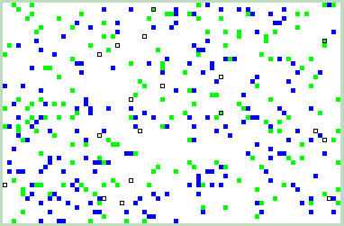
            *   After 7,000 time steps:  
                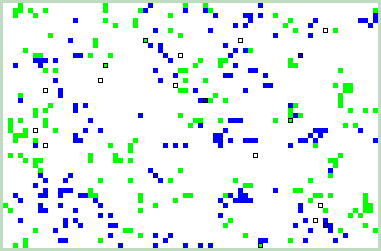
            *   After 70,000 time steps:  
                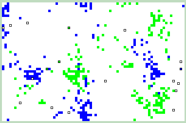
        *   They've managed to sort things pretty well without any overall plan

#### vants.py

*   Take a look at vants.py
    *   The first part shows how to make a very simple Cell that doesn't change on its own.

        <pre>class Cell:
          state=0
          def colour(cell):
            if cell.state==0: return 'black'
            else: return 'green'
         </pre>

    *   Next, we define the Vant as a collection of functions (much like we defined the Cell). These functions allow the agent to interact with the world.

        <pre>class Vant(cellular.Agent):
          </pre>

        Since we don't want the Vant to change colour, we can just set its colour.

        <pre>  colour='blue'
          </pre>

        Now we define the rules for controlling the agent. Note that we are referring to the agent as '`self`' here. The built-in functions that we can use are `self.turnLeft()`, `self.turnRight()`, `self.turnAround()`, and `self.goForward()`. We can also refer to the cell that the agent is on as `self.cell`. We could also use `self.aheadCell`, `self.leftCell`, and `self.rightCell`. As a reminder, if the Vant is on a cell of state 0, it changes it to state 1, turns right, and goes forwatd. Otherwise, it changes it to 0, turns left, and goes forward.

        <pre>  def update(self):
            if self.cell.state==0:
              self.cell.state=1
              self.turnRight()
              self.goForward()
            else:
              self.cell.state=0
              self.turnLeft()
              self.goForward()
          </pre>

    *   Next, we run the simulation. The only new thing in creating the world is that we are telling the world we only want it to have 4 directions (since the ant is supposed to turn 90 degrees each time).

        <pre>world=cellular.World(Cell,width=200,height=200,directions=4)
          </pre>

        Now we add the ant to the world. This creates a new ant and places it at (50,50). If we do not specify where the ant is to be placed, it is placed randomly. The dir=0 option tells the ant to start facing North (0 being north, 1 being east, 2 being south, and 3 being west).

        <pre>world.addAgent(Vant(),x=50,y=50,dir=0)
          </pre>

        Finally, we turn on the display and run the simulation.

        <pre>world.display.activate(size=3)
        while 1:
            world.update()
          </pre>

*   Run the simulation for 10,000 time steps. What has happened? What about after 20,000? 50,000? 100,000? (Note: you can use PgUp and PgDown to speed up and slow down the simulation)
*   Modify the code to add a second Vant in a different location:

    <pre>world.addAgent(Vant(),x=50,y=50,dir=0)
    world.addAgent(Vant(),x=10,y=10,dir=0)
      </pre>

*   What happens? What if you try it in a larger world? What about having more ants? What if they start in the same location?
*   We could guess that if we made a Vant with the opposite rule (turning left when this Vant would turn right, and vice versa), then all that would happen is we would get the mirror image of what we currently have. But what if we put a Vant of each type into this world? You can try this by copy-and-pasting the current 'Vant' class to make a 'Vant2' class. Modify it so that it will turn in the opposite direction as the original Vant. Now run the simulation with a Vant of each kind in it. What happens? What if you start them in the same place? (experiment with setting their initial direction by trying each of the following)

    <pre>world.addAgent(Vant(),x=50,y=50,dir=0)
    world.addAgent(Vant2(),x=50,y=50,dir=2)
    </pre>

    and

    <pre>world.addAgent(Vant(),x=50,y=50,dir=0)
    world.addAgent(Vant2(),x=50,y=50,dir=0)
    </pre>

    and

    <pre>world.addAgent(Vant(),x=50,y=50,dir=0)
    world.addAgent(Vant2(),x=50,y=50,dir=1)
    </pre>

*   What about having more vants in the simulation?

#### sorting.py

*   Take a look at sorting.py
    *   At the top of the file, there are some new things. These define the parameters for the simulation. Right now they reflect the values in the original published paper, but they can be changed. You can even add new things into the 'types' list, so that there are more than two types of objects in the world.

        <pre>numAgents=20

        memoryLength=15
        k_pickup=0.1
        k_drop=0.3

        empty='white'
        types=[('green',200),('blue',200)]
         </pre>

        Secondly, near the bottom of the file, you will see this:

        <pre>for type,count in types:
          for i in range(count):
            x=random.randrange(world.width)
            y=random.randrange(world.height)
            world.getCell(x,y).contents=type
         </pre>

        This is how the system randomly fills the world with objects as specified in the 'types' parameter, instead of loading it out of a file.
*   Run sorting.py. See what it does. To speed things up, you will definitely want to press PgUp a few times. What does it look like around 10,000 steps? 50,000? 100,000? Longer?
*   What happens if you adjust k_pickup? Try it with a few values between 0 and 1\. How does this affect the ant's sorting ability? What about adjusting k_drop?
*   Modify the program to have 4 types by adding 100 'red' objects and 100 'pink' objects. Run the simulation again. What happens?.

### Ants and Pheromones

*   A standard example of these models that people refer to a lot is ants following pheromones to form trails between the nest and some food source.
*   It's actually surprisingly difficult to get models that do this
*   The Environment:
    *   Each cell has a certain amount of each pheromone (initially 0)
    *   Some cells are marked as 'Food'
    *   Some cells are marked as 'Home'
    *   Cells adjust their amount of pheromone via diffusion and evaporation

        <pre>def update(self):
          total1=0
          total2=0
          for n in self.neighbours:
            total1+=n.pheromone1
            total2+=n.pheromone2
          average1=total1/len(neighbours)
          average2=total2/len(neighbours)
          self.pheromone1+=(average1-self.pheromone1)*diffusionRate
          self.pheromone2+=(average2-self.pheromone2)*diffusionRate
          self.pheromone1*=evaporationRate
          self.pheromone2*=evaporationRate
         </pre>

*   The Ants:
    *   Ants have two states: looking for food, and looking for home
    *   If they've found what they're looking for, then they switch states (i.e. if they are looking for food and the cell they are in is marked as being food, then they 'pick up' the food and set their state to looking for home)
    *   They release the opposite pheromone to what they are looking for
    *   They release less pheromone the longer they've been looking for it
    *   The probability of turning is based on the concentration of the pheromone they are looking for in that direction
    *   Various variables:
        *   evaporation rate
        *   diffusion rate
        *   amount of pheromone to drop
        *   how fast to decrease the amount of pheromone dropped
        *   the certainty of the turning probability (i.e. if there's twice as much pheromone to the left, should we turn left twice as often? More? Less?)
        *   how big is the world?
        *   how far away is the food source from the nest?
        *   how many food sources are there?
        *   how many ants?
*   What does it do?
    *   _(Run pheromone.py)_
    *   _(Note that the file tells you how to change the parameters)_
*   It takes a while, but it eventually works. The ants form a nice trail to some food sources (usually the closest). Not bad for some pretty simple creatures with no memory.

#### pheromones.py

*   Take a brief look at phAnts.py. It's a bit more complicated than we are used to, but it follows the same basic structure that we've seen so far. Both the cells and the ants are rather complicated. Fortunately, we don't really need to look at this file.
*   Instead, take a look at pheromones.py. Here, we have a simpler interface to phAnts.py We can simply do this:

    <pre>foodCount=phAnts.run()
    </pre>

    and it will run the simulation (with default settings for all the parameters). After the simulation is run, the next line will cause it to print out the average number of trips the ants make from their home to a food source and back.

    <pre>print foodCount
    </pre>

    You can adjust the parameters as described in the file.
*   Run pheromone.py as it is. What happens?
*   Modify pheromone.py to use the starting map 'lotsOfFood.txt'. Now what happens?
*   As you can see in this file, there are at least 11 parameters you can play with. Suppose you wanted to know what the 'best' parameter settings are (where 'best' is defined as the settings where the ants gather the most food). How could you do this? How many possibilities are there? Could you try them all?
*   Choose a few different parameters and see what happens when you vary them. For example, you could try setting the number of ants to 1, 5, 10, 20, and 50, running the simulation for each possibility. How does this affect how well the ants do?
*   Note that it becomes even more complicated if we want to vary two different parameters at the same time. After all, perhaps when the number of ants is low, we need a higher basePherAmount (the amount of pheromone an ant drops), and vice-versa? This is known to statisticians as an interaction effect, and it is both annoying for statistical analysis, and very very common.
*   How could we solve this problem of finding the best parameter settings?
